# say-hi

> Five screen scenes for the moment just before you take the photo.

You're at the café. The tea is steaming, the flowers cooperate, the light is
doing that thing. You want your laptop in the shot — but the laptop is
covered in work, unread messages, half-finished drafts, and that one tab you
keep telling yourself you'll close. So you close the lid. The photo loses
its main character.

**say-hi** is the thing you fire up instead. Each route is a full-screen
scene that looks like you're deep in something interesting, without
revealing a single real thing. Open a URL, press `F`, line up the shot.

**Live:** [zakelfassi.github.io/say-hi](https://zakelfassi.github.io/say-hi/)

---

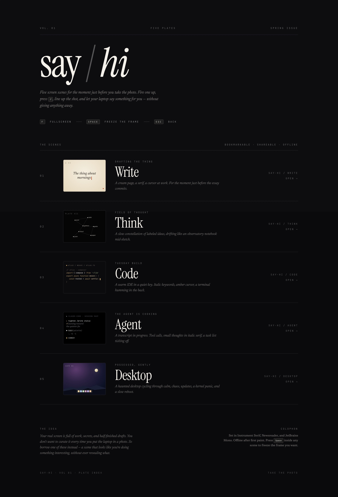

## The scenes

### 01 · `/write` — drafting the thing

A cream paper column, a serif at work, a red cursor. The typography is
doing the heavy lifting; the content rotates through a curated bank of
opening lines that could belong to anyone's essay.

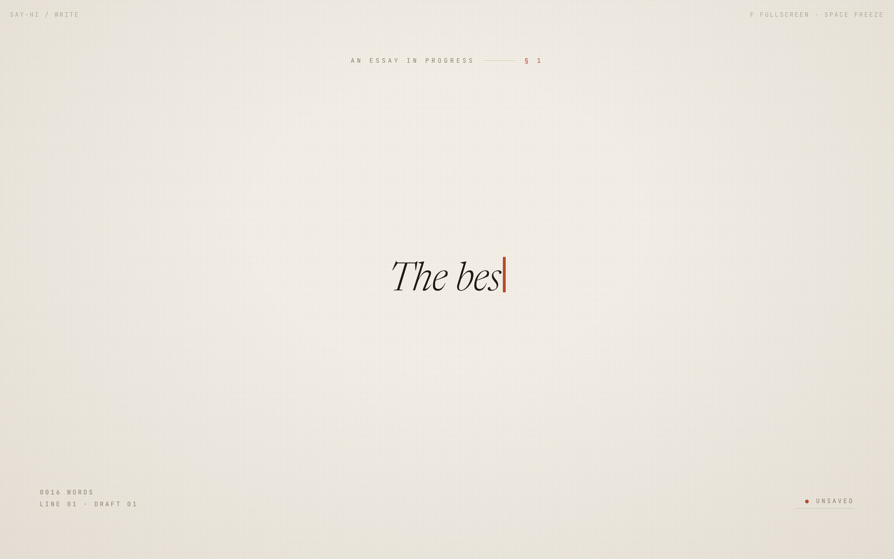

### 02 · `/think` — field of thought

A slow constellation of labeled ideas, drifting across a plate marked
`plate vii`. Nodes and edges recompute every frame on a sinusoidal orbit
around their anchor points. Feels like someone is actively mapping a
notebook.

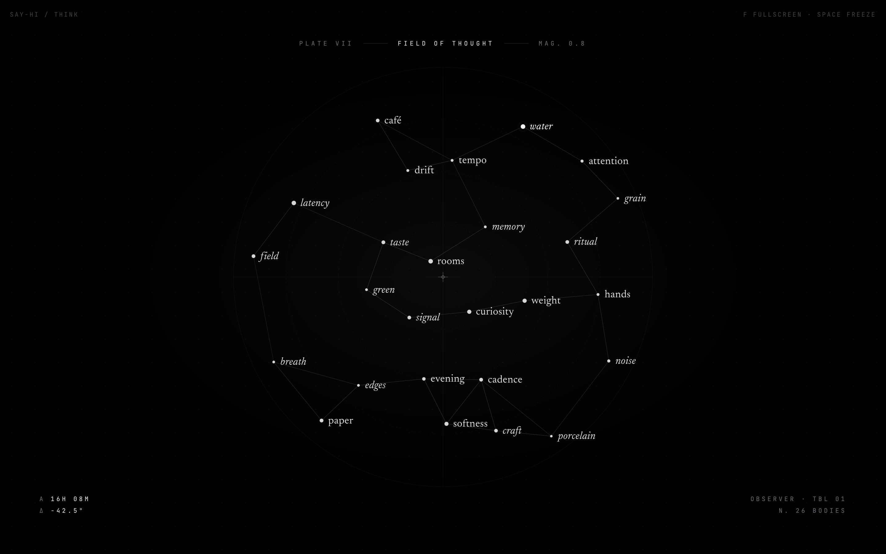

### 03 · `/code` — tuesday build

A warm IDE in a quiet key. Italic keywords, amber cursor, a file tree on
the left, a minimap on the right, a terminal humming at the bottom. The
pseudocode is tokenized by a tiny deterministic syntax highlighter that
speaks exactly one invented language.

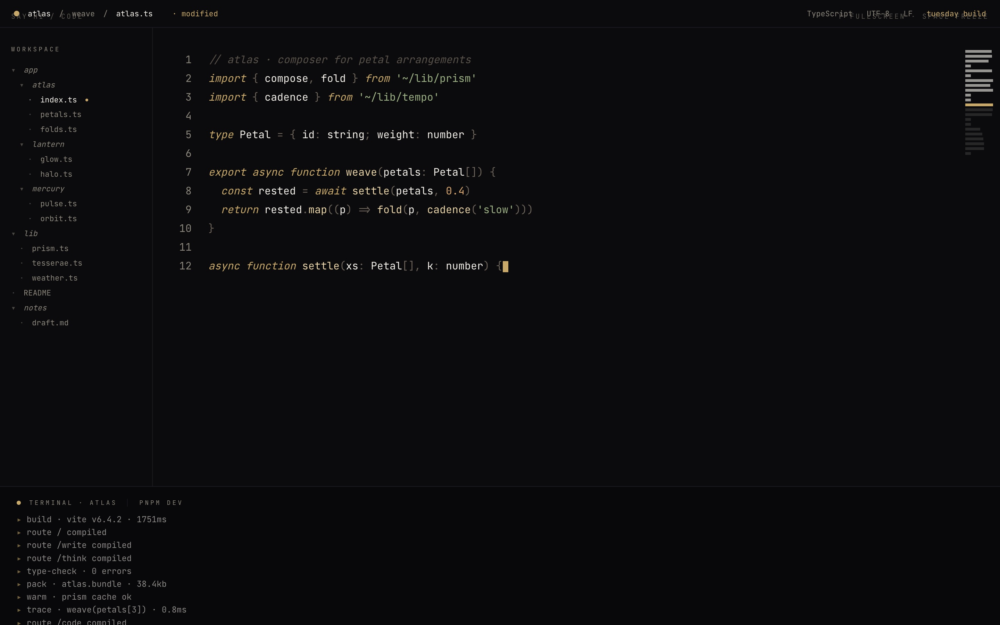

### 04 · `/agent` — the agent is cooking

A Claude-Code-style transcript in progress. Tool calls, small thoughts in
italic serif, a task list ticking off one item at a time on the right rail,
a running session meter at the top. Safe to photograph because every tool
call, path, and thought comes from a curated word bank.

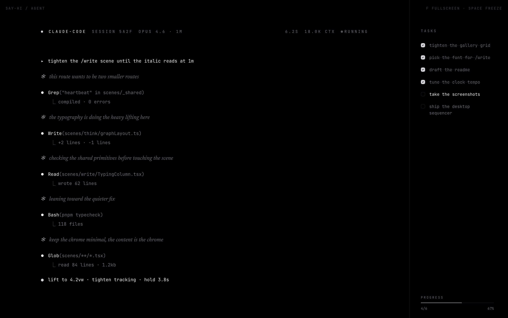

### 05 · `/desktop` — possessed, gently

The hero scene. A haunted desktop cycling through six states autonomously:

1. **Calm** — a tidy wallpaper with a moon, a few icons, a dock.
2. **Chaos** — the cursor takes over. Folders appear. A Finder window
   shakes. Icons rearrange.
3. **Typing** — a Notes window opens and starts typing nonsense lines in
   serif, deletes them, types others.
4. **Updating** — a system-update modal creeps a progress bar toward 97%.
   "Installing Café OS 26.3 · do not close your laptop."
5. **Panic** — randomized: either a retro blue-screen-of-death or a
   macOS-style kernel panic. The spiciest frame in the deck.
6. **Rebooting** — black screen, a logo, a thin loading bar.

Press `Space` at any point to freeze on the frame you want. You can also
bookmark a specific state directly with `?lock=<state>`:
[`/desktop?lock=panic`](https://zakelfassi.github.io/say-hi/desktop?lock=panic),
[`/desktop?lock=calm`](https://zakelfassi.github.io/say-hi/desktop?lock=calm),
etc.

| calm | chaos | typing |
|:--:|:--:|:--:|
| 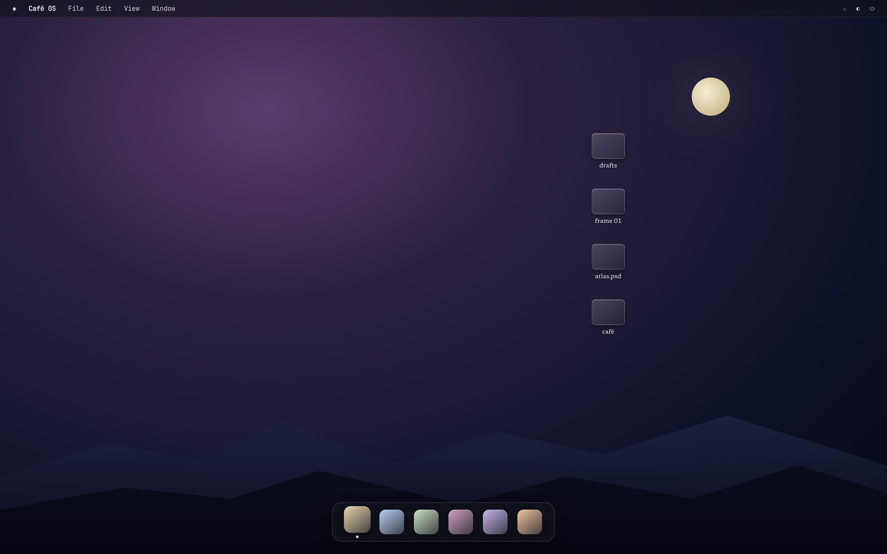 | 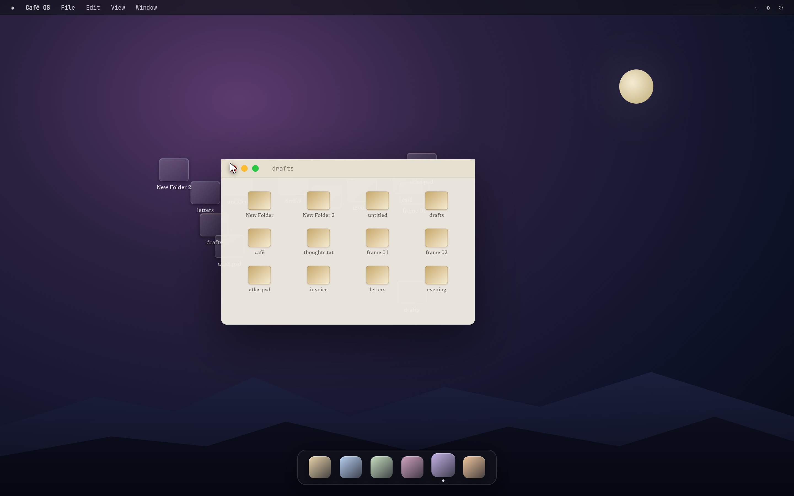 | 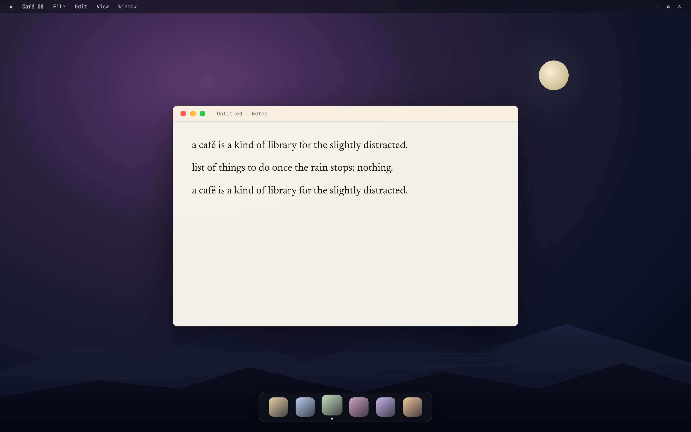 |
| **updating** | **panic** | **rebooting** |
| 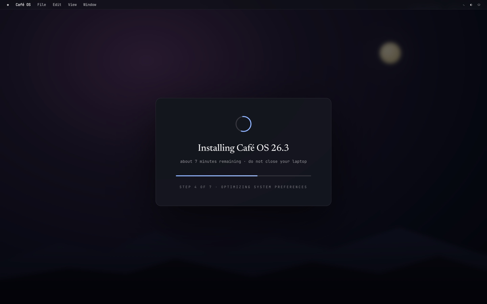 | 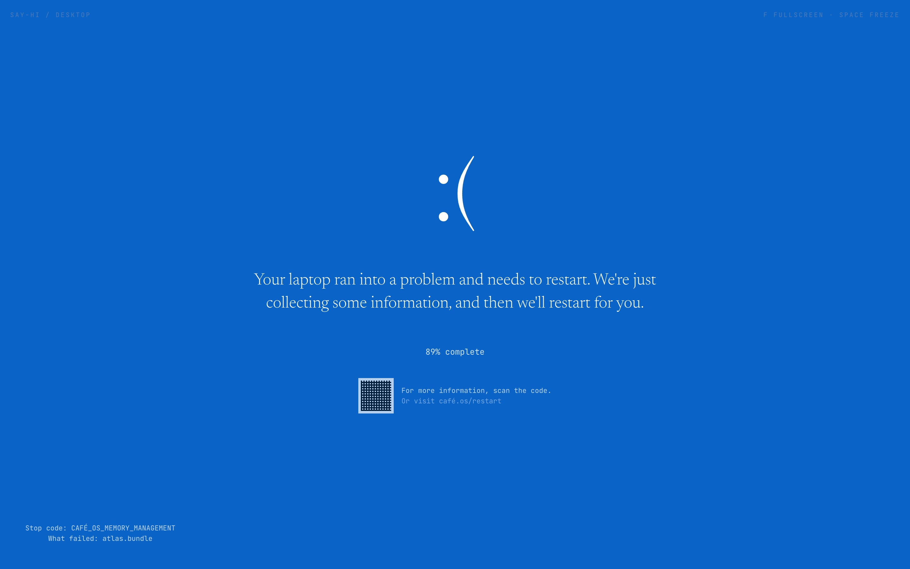 | 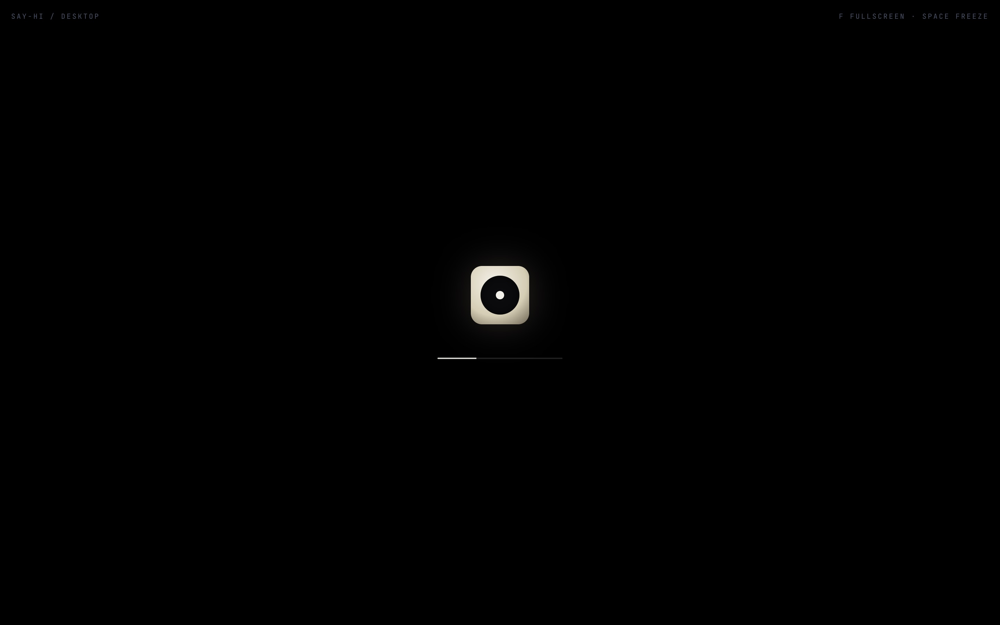 |

---

## How to use it (at a café)

1. Unlock your laptop. You're nervous. Don't be.
2. Open [zakelfassi.github.io/say-hi](https://zakelfassi.github.io/say-hi/).
3. Pick a scene. Click it.
4. Press **`F`** for fullscreen. The browser chrome disappears.
5. Pick up your phone. Frame the shot: tea, flowers, laptop, you.
6. When the scene hits the frame you want, press **`Space`** to freeze it.
7. Take the photo.
8. Press **`Esc`** to come back to work.

### Keyboard

| key | what |
|---|---|
| <kbd>F</kbd> | toggle browser fullscreen |
| <kbd>Space</kbd> | freeze / unfreeze the current frame |
| <kbd>Esc</kbd> | exit fullscreen |

### Query parameters

| param | values | effect |
|---|---|---|
| `?mood=` | `focus` · `flow` · `shipping` · `night` · `paper` | shift the palette |
| `?speed=` | `slow` · `normal` · `fast` | animation tempo |
| `?seed=` | any string | deterministic variety per session |
| `?lock=` | (`/desktop` only) `calm` · `chaos` · `typing` · `updating` · `panic` · `rebooting` | freeze the desktop scene on a specific state |

---

## Rules of the deck

Every scene is built to survive a phone camera at ~1m in café lighting.
That means:

- **No real clocks, dates, or notifications.** A wrong wall clock is the
  #1 tell that ruins the illusion.
- **High-contrast, large type.** Phone cameras average small type into
  mush. Minimum ~15px for body, 22px+ for the stuff meant to read.
- **Slow animation.** Everything moves under ~1Hz. Faster becomes motion
  blur.
- **Only curated vocabularies.** No scene can ever emit a real name,
  email, path, or secret. Every string is pulled from a hand-written word
  bank in `src/scenes/_shared/wordbank.ts`.
- **Offline after first paint.** Once the scene boots, nothing else hits
  the network. Flaky café wifi can't break the shot.
- **Freezable.** `Space` pauses the clock so you pick the frame, not the
  tool.

---

## Stack

- [Vite](https://vite.dev) + React 19 + TypeScript
- [TanStack Router](https://tanstack.com/router) (code-based routes)
- [Tailwind CSS v4](https://tailwindcss.com)
- [Motion](https://motion.dev) (for the animation bits that need it)
- pnpm · deployed to GitHub Pages via Actions

Typography is Newsreader (display + italic), Instrument Serif (the
masthead), and JetBrains Mono (everywhere a number lives), all from
Google Fonts, preloaded once and then never touched.

## Running locally

```sh
pnpm install
pnpm dev            # http://localhost:5178
pnpm build          # production bundle
pnpm typecheck      # tsc -b --noEmit
```

## Project layout

```
src/
  main.tsx
  router.tsx
  routes/
    gallery.tsx        # the / index, editorial contact sheet
  scenes/
    _shared/           # clock, fullscreen, pause, palette, RNG, word bank
    write/             # /write
    think/             # /think + graph layout
    code/              # /code + fake syntax highlighter
    agent/             # /agent
    desktop/           # /desktop + its six sub-states
  styles.css
.github/
  screenshots/         # the shots in this README
  workflows/deploy.yml # build → upload → deploy-pages on every push to main
```

## Adding a new scene

1. Create `src/scenes/<name>/<Name>Scene.tsx`. Export `function <Name>Scene()`.
2. Wrap its root in `<SceneFrame name="<name>" mood="…" paused togglePause>`
   from `scenes/_shared/SceneFrame`.
3. Build whatever you want inside. Use the shared primitives (`useSceneClock`,
   `mulberry32`, `sessionSeed`, palette vars) so `?speed`, `?mood`, `?seed`,
   and `Space` pause all work without extra wiring.
4. Add a route in `src/router.tsx`.
5. Add an entry + plate in `src/routes/gallery.tsx`.
6. Never pull strings from anything but `_shared/wordbank.ts`. If you need
   a new category of word, add it there.

---

## Why

Because closing the lid makes the photo worse. Because your screen is
allowed to say something. Because the difference between a photo you
share and a photo you delete is sometimes just what was on the computer
in the background. This is a tiny tool for that tiny gap.

Go take the photo.
